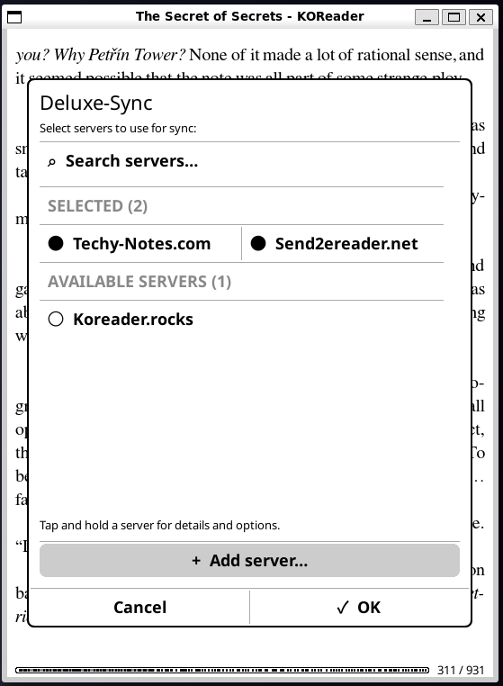
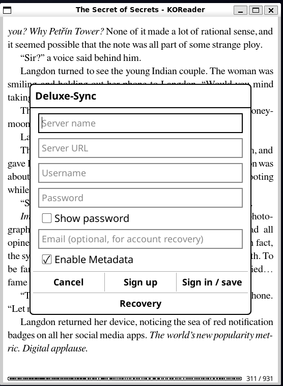
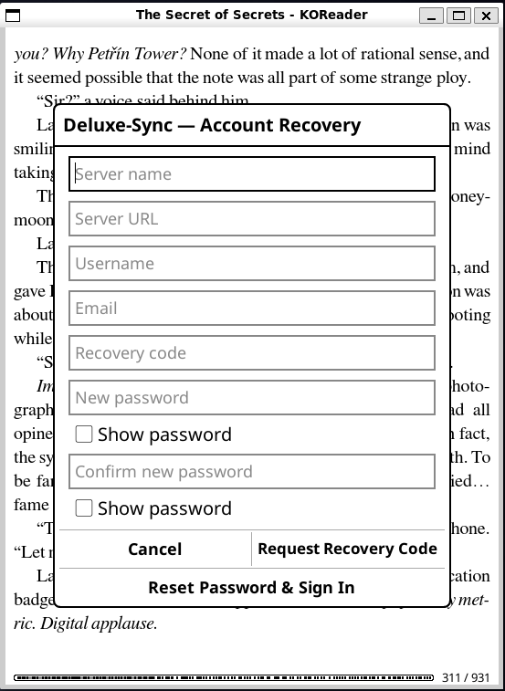
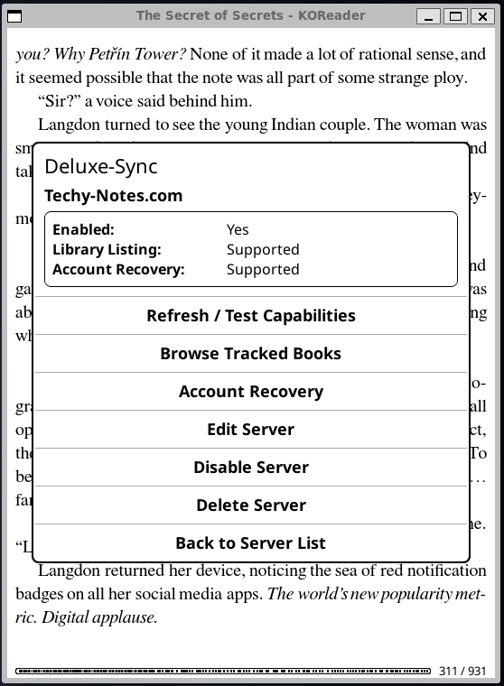
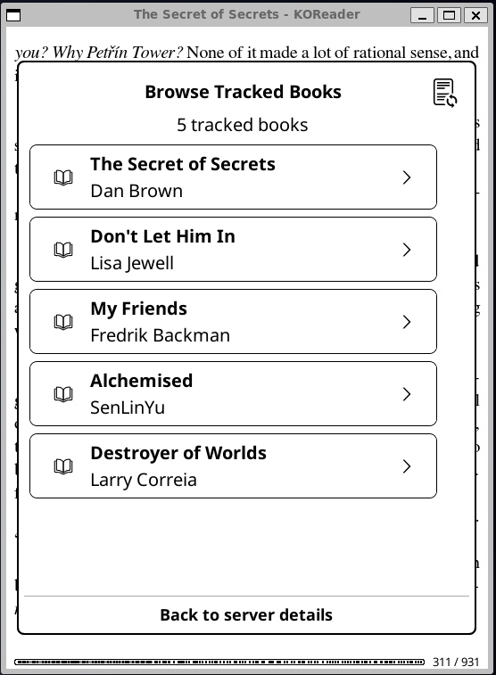
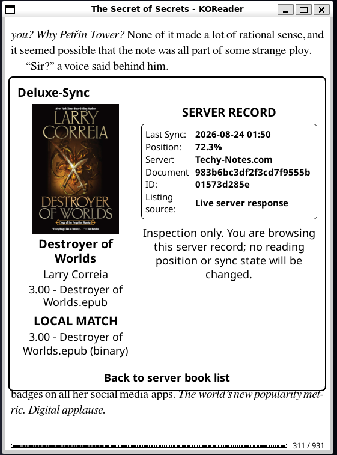
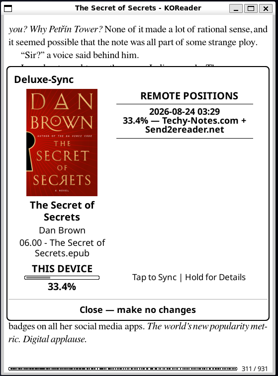
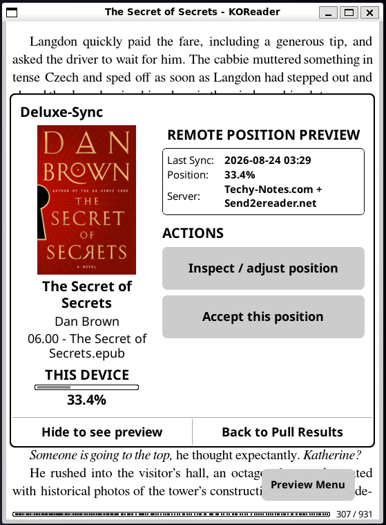
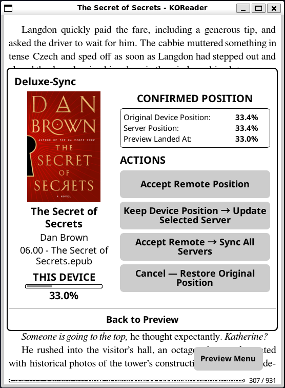
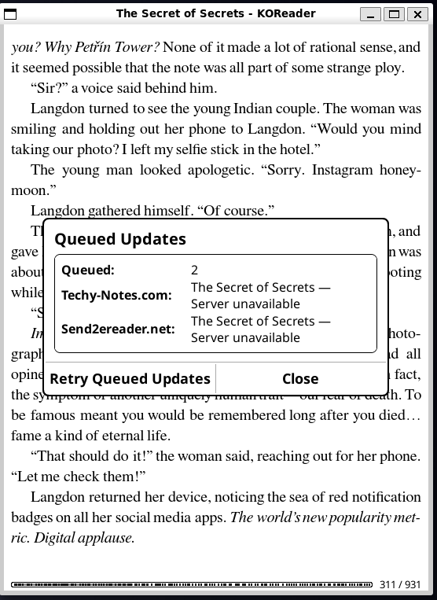

# Deluxe-Sync

Deluxe-Sync is a KOReader plugin that extends the built-in KOSync workflow to multiple independent KOReader-compatible servers.

Current plugin version: **0.1.0**

## Overview

Deluxe-Sync lets you configure multiple KOSync servers and push or pull reading progress across them from one plugin. It remains compatible with standard KOSync servers while detecting optional enhanced capabilities such as metadata, remote library listing, and account recovery.

Key capabilities include:

- Multiple independently configured KOSync servers.
- Manual multi-server push and pull with a consolidated Pull Results view.
- Optional automatic syncing. **Auto-Sync Documents is OFF by default** and must be enabled by the user.
- Independent behavior for newer and older remote positions.
- Per-server offline/transient retry queues with queue inspection and manual retry.
- Metadata-aware enhanced-server support with automatic fallback to the standard KOSync payload.
- Remote library browsing when supported by the server.
- Safe remote-position review and preview before accepting a sync.
- Optional six-digit email account recovery when supported by the server.
- Built-in GitHub update checks and in-plugin updates.

When Deluxe-Sync starts with no configured servers, it offers the complimentary **Techy-Notes.com** server at `https://sync.techy-notes.com` or lets the user configure a custom KOSync server. The complimentary server supports standard KOSync progress syncing plus metadata, remote library listing, and account recovery. Selecting it does not automatically enable Auto-Sync Documents.

## Screenshots

<p align="center">
  
  
  
  
  
  
  
  
  
  
</p>

## Installation

1. Download the latest `deluxe-sync.koplugin.zip` from GitHub Releases.
2. Extract the ZIP.
3. Copy the entire `deluxe-sync.koplugin` folder to KOReader's `plugins` folder.
4. Restart KOReader.
5. Open a book, then use **Deluxe-Sync** from the reader menu.

After the initial installation, future releases can be installed directly from **Deluxe-Sync → Check for Updates**.

## Protocol and payload examples

The examples below use placeholders only. KOSync user keys are derived values, not plaintext passwords.

### Account registration

Deluxe-Sync uses the standard KOSync registration body:

```json
{
  "username": "reader01",
  "password": "[REDACTED_SECRET]"
}
```

The value sent as `password` is the derived KOSync user key generated from the password entered in the plugin, matching KOReader's built-in Progress Sync behavior.

### Login / authorization

Authorization does not send a JSON login body. Deluxe-Sync sends the KOSync credentials as HTTP headers:

```text
Accept: application/vnd.koreader.v1+json
X-Auth-User: reader01
X-Auth-Key: [REDACTED_SECRET]
```

### Standard progress push

```json
{
  "document": "[DOCUMENT_DIGEST]",
  "progress": "[KOREADER_PROGRESS_OR_XPOINTER]",
  "percentage": 0.7087,
  "device": "Kobo_clara_bw",
  "device_id": "[DELUXE_SYNC_DEVICE_ID]"
}
```

### Enhanced progress push with metadata

When metadata is enabled for a compatible server, Deluxe-Sync extends the standard payload with:

```json
{
  "document": "[DOCUMENT_DIGEST]",
  "progress": "[KOREADER_PROGRESS_OR_XPOINTER]",
  "percentage": 0.7087,
  "device": "Kobo_clara_bw",
  "device_id": "[DELUXE_SYNC_DEVICE_ID]",
  "metadata": {
    "filename": "Destroyer of Worlds.epub",
    "title": "Destroyer of Worlds",
    "authors": "Matt Ruff"
  }
}
```

The metadata extension currently contains exactly `filename`, `title`, and `authors`. If metadata is disabled or the server is detected as metadata-incompatible, Deluxe-Sync falls back to the standard payload.

### Recovery email enrollment

Authenticated request body:

```json
{
  "email": "[RECOVERY_EMAIL]"
}
```

### Request a recovery code

```json
{
  "username": "reader01",
  "email": "[RECOVERY_EMAIL]"
}
```

### Confirm password recovery

```json
{
  "username": "reader01",
  "email": "[RECOVERY_EMAIL]",
  "code": "[SIX_DIGIT_CODE]",
  "new_userkey": "[REDACTED_SECRET]"
}
```

After a successful reset, Deluxe-Sync verifies the replacement credential before saving it.

## Project links

- [Techy Notes](https://techy-notes.com) — blog, projects, notes, and guides.
- [Jadehawk on YouTube](https://youtube.com/@jadehawk) — project videos and tutorials.
- [Buy Me a Coffee](https://buymeacoffee.com/jadehawk) — support development of these projects.
- [Deluxe-Sync on GitHub](https://github.com/jadehawk/deluxe-sync.koplugin) — source code, releases, and issue tracking.

## Runtime data

All plugin-owned runtime state is kept under KOReader's `settings/deluxe-sync/` directory. `settings.lua` stores servers, known documents, and plugin options; `queue.lua` stores retry work; and `logs/deluxe-sync.log` records plugin diagnostics. Diagnostic logging can be disabled from the Deluxe-Sync menu.

## Development

The repository contains the installable KOReader plugin in `deluxe-sync.koplugin/` together with its Lua tests under `deluxe-sync.koplugin/spec/`. The compatibility target is Lua 5.1 / LuaJIT as used by KOReader.
