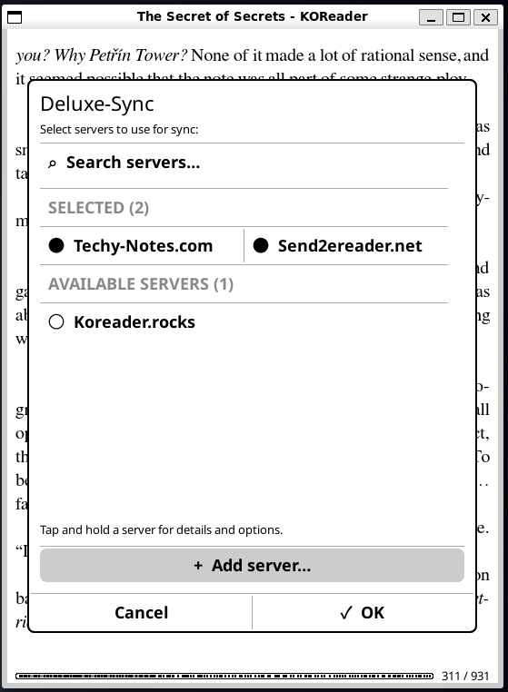
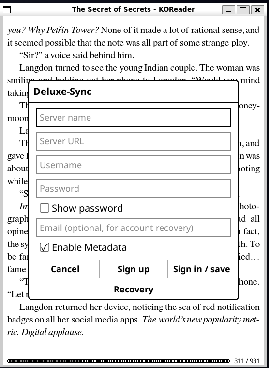
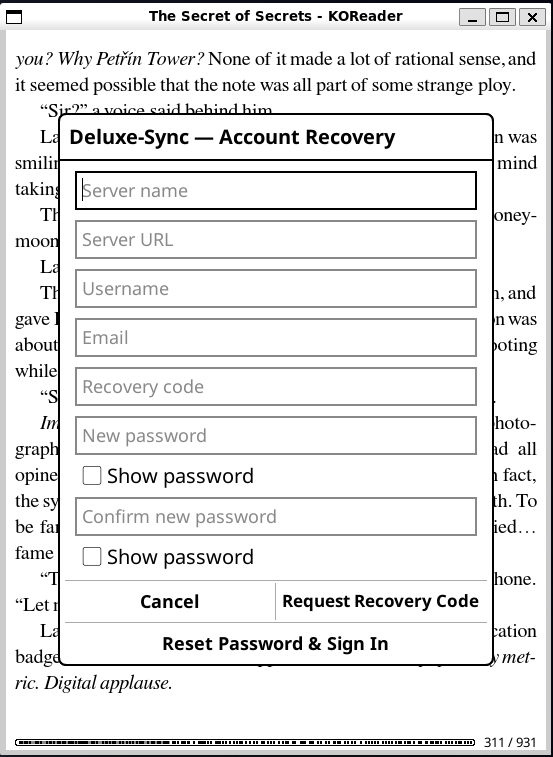
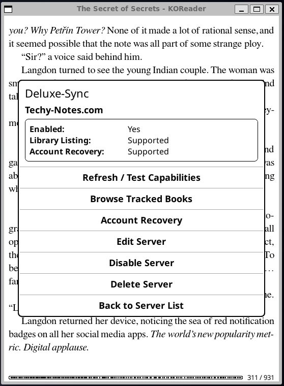
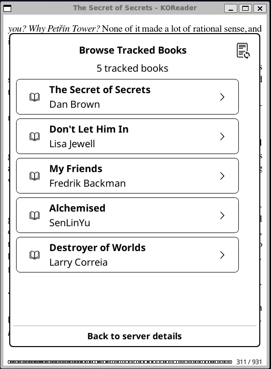
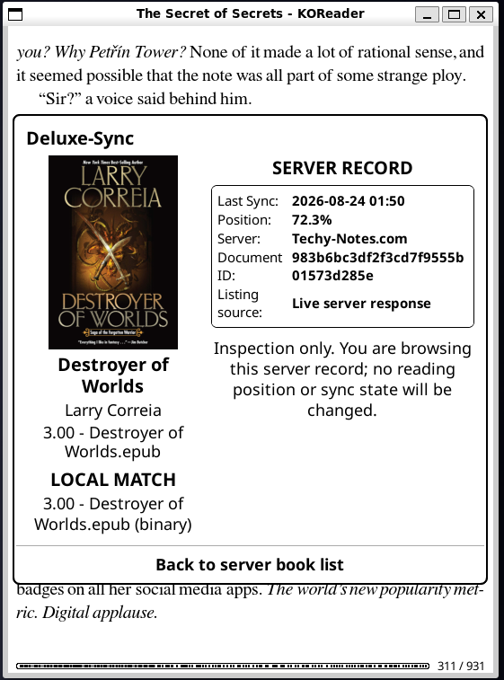
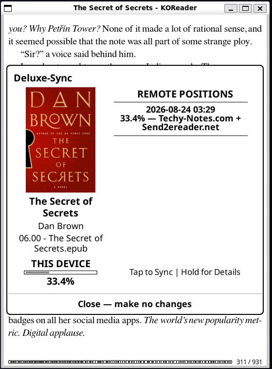
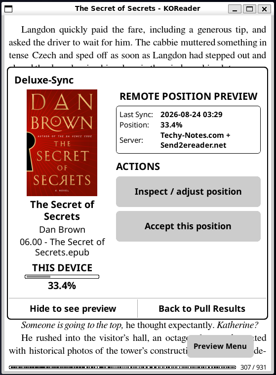
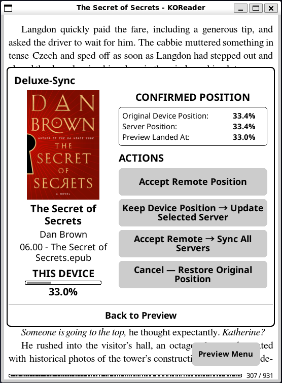
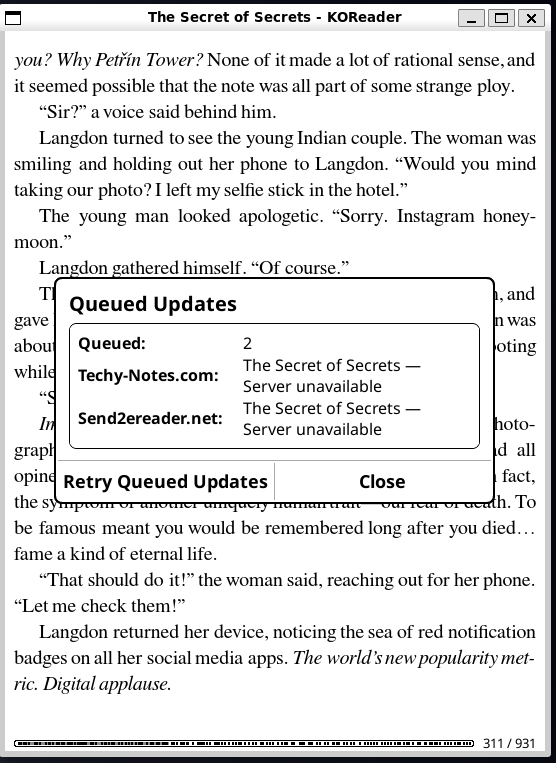

# Deluxe-Sync

Deluxe-Sync is a KOReader plugin that extends the built-in KOSync workflow to multiple independent KOReader-compatible servers.

Current plugin version: **0.1.8**

- Enhanced Techy-Notes servers can register one durable physical device using the existing Deluxe device ID plus KOReader UUID/model/platform/version metadata; unsupported KOSync servers are unchanged.
- Enhanced servers advertising annotation sync v1 can synchronize KOReader highlights, notes, and bookmarks with stable IDs, revision conflicts, and deletion tombstones; ordinary KOSync servers receive no annotation traffic.
- Enhanced servers advertising reading-statistics v1 can receive KOReader's existing `statistics.sqlite3` history through a read-only, resumable, deduplicated upload; Deluxe-Sync never writes to KOReader's live statistics database.
- Enhanced servers advertising settings-backup v1 can receive sanitized, versioned settings snapshots for the current physical device. Credentials and device identity are filtered on the reader before upload, unchanged snapshots are skipped, and a server-requested restore still requires explicit confirmation on that same reader.

## Overview

Deluxe-Sync lets you configure multiple KOSync servers and push or pull reading progress across them from one plugin. It remains compatible with standard KOSync servers while detecting optional enhanced capabilities such as metadata, remote library listing, account recovery, rich positions, durable device identity, annotation synchronization, reading statistics, and safe per-device settings backups.

Key capabilities include:

- Multiple independently configured KOSync servers.
- Manual multi-server push and pull with a consolidated Pull Results view.
- KOReader gesture/dispatcher integration for Auto-Sync On/Off, Auto-Sync Toggle, Push Progress to All, and Pull Progress from All.
- Optional automatic syncing. **Auto-Sync Documents is OFF by default** and must be enabled by the user.
- Independent behavior for newer and older remote positions.
- Per-server offline/transient retry queues with queue inspection and manual retry.
- Metadata-aware enhanced-server support with automatic fallback to the standard KOSync payload.
- Remote library browsing when supported by the server.
- Per-server document matching: binary partial-MD5 by default, or KOReader-compatible filename matching using the MD5 of the basename.
- Server-side logical-book linking on capable enhanced servers, with linked versions presented as one book while raw sync identities remain intact and reversible.
- Capability-gated KOReader annotation sync on enhanced servers, including highlights, notes, bookmarks, offline-safe revision conflicts, and tombstones.
- Capability-gated read-only KOReader reading-statistics upload with resumable history import and server-side deduplication.
- Capability-gated per-device settings backups with client-side secret filtering, checksum deduplication, and same-device reader-confirmed restore.
- Safe remote-position review and preview before accepting a sync.
- Optional six-digit email account recovery when supported by the server.
- Built-in GitHub update checks and in-plugin updates.

When Deluxe-Sync starts with no configured servers, it offers the complimentary **Techy-Notes.com** server at `https://sync.techy-notes.com` or lets the user configure a custom KOSync server. The complimentary server supports standard KOSync progress syncing plus metadata, remote library listing, account recovery, rich positions, durable device identity, logical books, annotation synchronization, reading statistics, and safe per-device settings backups. Selecting it does not automatically enable Auto-Sync Documents.

## Screenshots

<p align="center">
  
  
  
  
  
  
  
  
  
  
</p>

## Installation

1. Download the latest `deluxe-sync.koplugin.zip` from GitHub Releases.
2. Extract the ZIP.
3. Copy the entire `deluxe-sync.koplugin` folder to KOReader's `plugins` folder.
4. Restart KOReader.
5. Open a book, then use **Deluxe-Sync** from the reader menu.

After the initial installation, future releases can be installed directly from **Deluxe-Sync → Check for Updates**.

## Gesture actions

Deluxe-Sync registers reader actions with KOReader's Dispatcher, so they can be assigned anywhere KOReader exposes configurable gesture or button actions.

Available Deluxe-Sync actions:

- **Deluxe-Sync: Set Auto-Sync** — explicitly set Auto-Sync On or Off.
- **Deluxe-Sync: Toggle Auto-Sync** — switch Auto-Sync between enabled and disabled.
- **Deluxe-Sync: Push progress to all** — push the current document progress to all enabled Deluxe-Sync servers.
- **Deluxe-Sync: Pull progress from all** — query all enabled Deluxe-Sync servers for progress on the current document.

Push and Pull gestures use the same multi-server logic as the reader menu. If Deluxe-Sync is not ready, preview mode is active, or no sync server is enabled, the action shows a message instead of failing silently. Auto-Sync remains **OFF by default** until the user enables it.

## Protocol and payload examples

The examples below use placeholders only. KOSync user keys are derived values, not plaintext passwords.

### Account registration

Deluxe-Sync uses the standard KOSync registration body:

```json
{
  "username": "reader01",
  "password": "[REDACTED_SECRET]"
}
```

The value sent as `password` is the derived KOSync user key generated from the password entered in the plugin, matching KOReader's built-in Progress Sync behavior.

### Login / authorization

Authorization does not send a JSON login body. Deluxe-Sync sends the KOSync credentials as HTTP headers:

```text
Accept: application/vnd.koreader.v1+json
X-Auth-User: reader01
X-Auth-Key: [REDACTED_SECRET]
```

### Standard progress push

```json
{
  "document": "[DOCUMENT_DIGEST]",
  "progress": "[KOREADER_PROGRESS_OR_XPOINTER]",
  "percentage": 0.7087,
  "device": "Kobo_clara_bw",
  "device_id": "[DELUXE_SYNC_DEVICE_ID]"
}
```

### Enhanced progress push with metadata

When metadata is enabled for a compatible server, Deluxe-Sync extends the standard payload with:

```json
{
  "document": "[DOCUMENT_DIGEST]",
  "progress": "[KOREADER_PROGRESS_OR_XPOINTER]",
  "percentage": 0.7087,
  "device": "Kobo_clara_bw",
  "device_id": "[DELUXE_SYNC_DEVICE_ID]",
  "metadata": {
    "filename": "Destroyer of Worlds.epub",
    "title": "Destroyer of Worlds",
    "authors": "Matt Ruff"
  }
}
```

The metadata extension currently contains exactly `filename`, `title`, and `authors`. If metadata is disabled or the server is detected as metadata-incompatible, Deluxe-Sync falls back to the standard payload.

### Rich reading position on capable servers

When `/api/v1/capabilities` advertises `rich_progress: true` and `rich_position_version >= 1`, Deluxe-Sync also sends a format-neutral `position` object. `pctQ` is always derived from KOReader's percentage. Real KOReader page/page-count hints are included when available, and reflowable documents include KOReader's native XPointer when it fits the protocol limit. Deluxe-Sync does not fabricate EPUB-only spine/paragraph/anchor fields for formats that do not expose them reliably.

Exact same-file pulls still use KOReader's native `progress` value. When the remote record belongs to an alternate linked version, Deluxe-Sync uses `pctQ` as the portable fallback rather than applying a foreign page number or XPointer. Servers that do not advertise rich progress continue receiving the original standard KOSync payload.

### Annotation sync on capable servers

When `/api/v1/capabilities` advertises `annotations: true` and `annotations_version >= 1`, Deluxe-Sync synchronizes KOReader highlights, notes, and bookmarks alongside the normal progress workflow. Each local annotation receives a stable `deluxe_sync_id` that is persisted inside KOReader's document annotations, while Deluxe-Sync separately remembers the last server revision and delta cursor for each server/document pair.

Local edits and deletes are captured before remote deltas are applied. Updates target the last server revision the device actually observed; stale writes are returned as conflicts and the current server copy wins. Deletes are revisioned tombstones, so an offline device cannot accidentally resurrect an annotation that was deleted elsewhere. Annotation failures never enter the normal progress retry queue and never change standard KOSync success/failure behavior.

Annotation positions always belong to the exact physical document identity that produced them. Linked books may aggregate their members for server-side viewing, but Deluxe-Sync does not translate a highlight or bookmark position from one EPUB/PDF version into another physical file. Servers that do not advertise annotation sync receive no Stage 7 annotation requests.

### Document matching

Each server stores its own document matching method. Binary is the backward-compatible default and sends KOReader's partial MD5 checksum. Filename mode sends the MD5 of the document basename, matching KOReader's built-in Progress Sync filename behavior. This lets different Deluxe-Sync servers use different matching rules at the same time.

### Logical-book linking on enhanced servers

When an enhanced server advertises logical_books and logical_library, Browse Tracked Books uses the server logical-library view. Already-linked versions appear as one logical book, while only unlinked raw records can be selected for a new link. Linking is non-destructive and reversible: the raw KOSync identities remain stored independently.

Before a link is created, Deluxe-Sync asks which selected version should supply the initial shared reading position. The furthest stored percentage is recommended by default, with the latest timestamp used only to break a tie, but the user can explicitly choose another version when a restart or deliberate backward position is correct.

### Recovery email enrollment

Authenticated request body:

```json
{
  "email": "[RECOVERY_EMAIL]"
}
```

### Request a recovery code

```json
{
  "username": "reader01",
  "email": "[RECOVERY_EMAIL]"
}
```

### Confirm password recovery

```json
{
  "username": "reader01",
  "email": "[RECOVERY_EMAIL]",
  "code": "[SIX_DIGIT_CODE]",
  "new_userkey": "[REDACTED_SECRET]"
}
```

After a successful reset, Deluxe-Sync verifies the replacement credential before saving it.

## Project links

- [Techy Notes](https://techy-notes.com) — blog, projects, notes, and guides.
- [Jadehawk on YouTube](https://youtube.com/@jadehawk) — project videos and tutorials.
- [Buy Me a Coffee](https://buymeacoffee.com/jadehawk) — support development of these projects.
- [Deluxe-Sync on GitHub](https://github.com/jadehawk/deluxe-sync.koplugin) — source code, releases, and issue tracking.

## Runtime data

All plugin-owned runtime state is kept under KOReader's `settings/deluxe-sync/` directory. `settings.lua` stores servers, known documents, and plugin options; `queue.lua` stores retry work; and `logs/deluxe-sync.log` records plugin diagnostics. Diagnostic logging can be disabled from the Deluxe-Sync menu.

## Development

The repository contains the installable KOReader plugin in `deluxe-sync.koplugin/` together with its Lua tests under `deluxe-sync.koplugin/spec/`. The compatibility target is Lua 5.1 / LuaJIT as used by KOReader.
